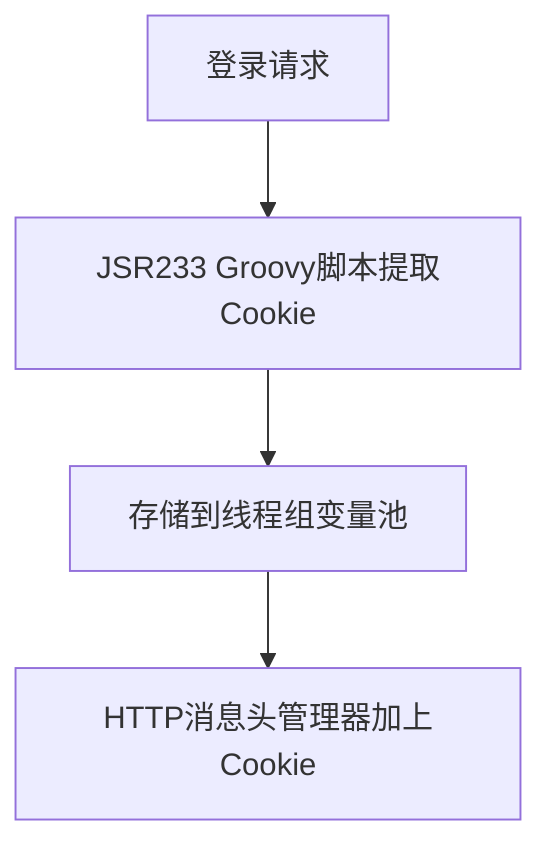

我司采用单点登录用Cookie做身份认证，在进行JMeter性能测试时，仅使用HTTP Cookie Manager仍提示未登录。原因在于单点登录服务器的域名与待测试的服务器域名不一致，Cookie Manager不支持跨域Cookie。本文介绍两种方法来处理。
<!--more-->

# JMeter 跨线程组共享变量（单点登录Cookie无法保存）

## 背景

部分待测试的业务接口需要登录信息认证，根据Cookie确认身份，测试时候，业务接口报`403没有登录`

## 分析

本来在线程组中加入登录的http请求就可以，但是登录接口的域名跟待测业务的域名不一样，导致默认的`Cookie Manager`忽略了Cookie，所以出现加入了Cookie Manager后还是无法处理跨域的Cookie。

## 解决方案

既然自带的`Cookie Manager`没法处理，就要写点脚本代码来运行了。思路如下




```groovy
import java.io.BufferedReader;
import java.io.StringReader;
import java.util.ArrayList;
import java.util.List;

String responseheaders = prev.getResponseHeaders();
BufferedReader buffer_reader = new BufferedReader(new StringReader(responseheaders));
List<String> response_origin_list = new ArrayList<>();

for (String line = buffer_reader.readLine(); line != null; line = buffer_reader.readLine()) {
    response_origin_list.add(line);
}

int origin_size = response_origin_list.size();
String response_cookie = "";

for (i = 0; i < origin_size; i++) {
    String[] cookie_item = response_origin_list[i].split(":");
    if (cookie_item[0].equals("Set-Cookie"))
        response_cookie += cookie_item[1].trim() + ";";
}

String response_cookie_final = response_cookie.substring(0, response_cookie.length() - 1);

vars.put("responsecookie", response_cookie_final);
```

简单分析一下上面的groovy脚本，跟Java基本一样，理解上不难。`prev`是内置的系统变量，`vars`也是像Map一样的内置变量，但是vars是线程组内可见。


## 改进方案

上述的改造已经可以完成基本的性能测试，如果进行高压的长时间稳定性测试Cookie也不会超时，但是有可能把比较脆弱的登录接口压垮。

解决方法：将登陆接口单独开一个进程组，一分钟跑一次，得到的Cookie放到`properties`里面来进行跨线程组共享的目的。


> ${__setProperty(newCookie,${responsecookie},)};


> ${__property(newCookie)


**小提示**：假如会话超时是1分钟，定时执行登录的线程组就行，这里如果用`Timer`的话就是先暂停后再登录，这样一开始就没有Cookie了。所以在登录之后，应该加一个Test Action来充当sleep。


<!--stackedit_data:
eyJoaXN0b3J5IjpbMTIzMjg3OTI3OCwtMTY4NjA3NDcyNF19
-->