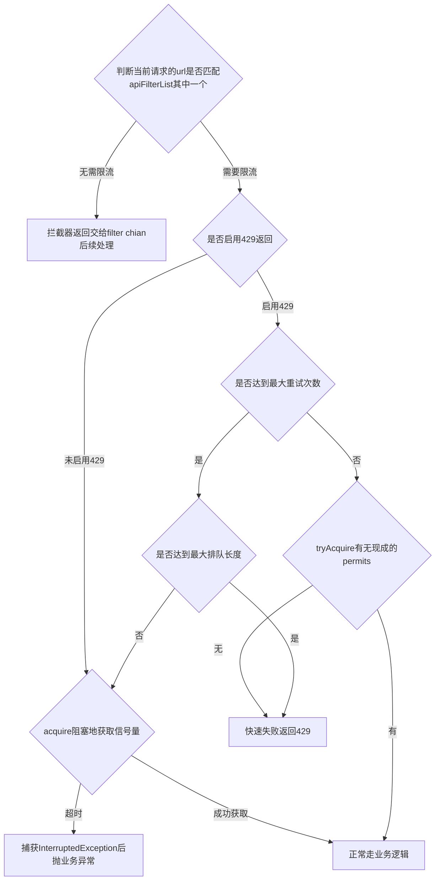

# 高可用之接口限流
## 限流方案
1. 请求存消息队列，实例根据自己处理能力，拉取消息消费
2. 线程池控制，排满线程池队就直接失败
3. 请求拦截器，维护一个信号量控制同时并发处理数，超出排队值(require排队)就返回429状态码

## 信号量方案
Spring管理唯一bean，内含唯一的限流拦截器。以下是关键变量
Semaphore current_model_semaphore 所有请求都共用一个信号量；
int semaphoreSize 信号量有多少permits
int semaphoreMaxQueueSize 设定多少请求可以排队，超了就抛异常了
List<String> apiFilterList 哪些URL需要拦截
ConcurrentMap<String, AtomicInteger> concurrents 接口对应有多少个当前处理数
Boolean returnTooManyRequestError 是否启用429返回

## 处理逻辑
1. 判断当前请求的url是否匹配apiFilterList其中一个，不匹配返回filter chain后续处理
2. 如果未启动429返回，则阻塞地获取信号量。获取成功则继续处理，超时会触发 InterruptedException ，捕捉后抛业务异常
3. 如果请求头没有标识本次请求为最后一次重试，调用tryAcquire()获取信号量的permits，如果没有现成可用的permits，立即返回，接着就返回429状态码，结束请求
4. 如果已达最大重试次数，那么本次请求应该更加“倔强”地等。如果排队获取信号量的线程还没达到设定的最长semaphoreMaxQueueSize，那么就acquire等待。如果队伍已满，只能放弃等待直接返回429.
5. 所有acquire()后，在finally块做信号量的release()

