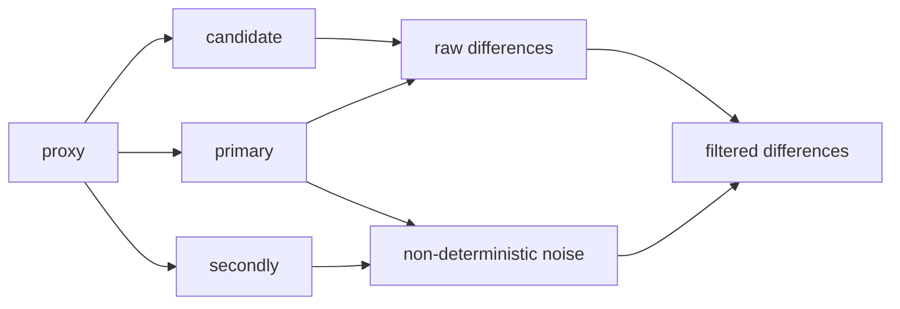
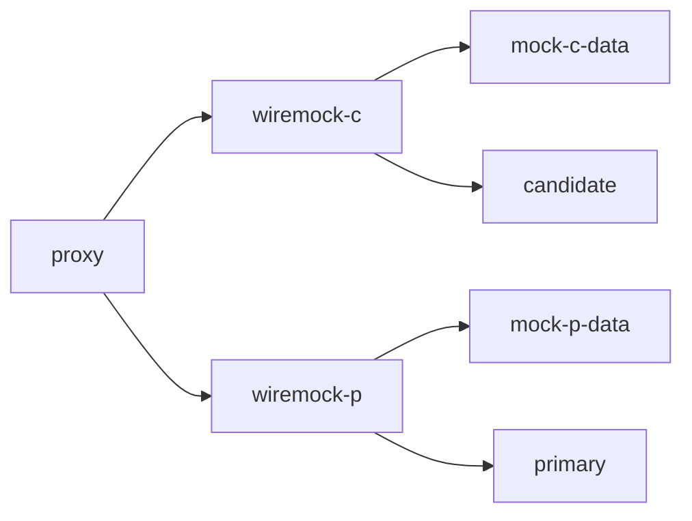
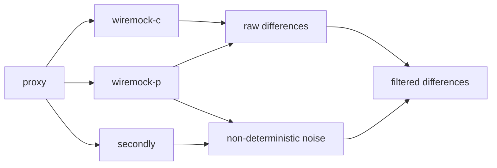

# 使用场景

企业内部软件重构，接口的功能完全不变的情况下，切换数据库，或者使用元数据、多租户等技术。此时要求测试能快速全面的进行功能测试。

已有的接口自动化测试可以作为请求的发起端，接口的返回使用diffy进行断言。如果接口返回简单，需要检查数据库，将数据库查询使用接口实现，返回的数据行也作为接口的返回体，放入diffy做断言。

## 原理图

diffy原版使用

录制primary、candidate的返回体，存储起来。wiremock-standalone存文件

回放primary、candidate的返回体


# 试验命令cheatsheet

启动primary服务
>java -jar diffy-mock-0.0.1-SNAPSHOT.jar --server.port=9990

启动secondly服务
>java -jar diffy-mock-0.0.1-SNAPSHOT.jar --server.port=9991

启动candidate服务
>java -jar diffy-mock-0.0.1-SNAPSHOT.jar --server.port=9992

启动wiremock
>jave -jar .\wiremock-standalone-2.27.2.jar

浏览器打开 http://localhost:8080/__admin/recorder/

配置record http://localhost:9990

自动化脚本配置http_proxy=http://localhost:8080,或者将服务器hostip改成localhost:8080也行，是的请求的流量能到wiremock，并录制

请求完成后，点击stop，此时已经切换成回放模式。查看wiremock-standalone-2.27.2.jar目录能发现mapping目录，里面就是记录请求和返回的json。

启动diffy

```
java -jar diffy-server.jar^
 -candidate=localhost:9992^
 -master.primary=localhost:8080^
 -master.secondary=localhost:9991^
 -service.protocol=http^
 -serviceName=Mock-Service^
 -proxy.port=:8880^
 -admin.port=:8881^
 -http.port=:8888^
 -rootUrl=localhost:8888^
 -excludeHttpHeadersComparison=true^
```

