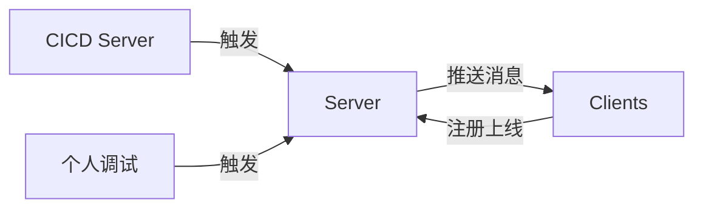
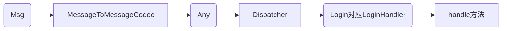

# 年近三十程序员

居住：深圳/广州
岗位：测试开发
学位：硕士
联系方式(base64): MzYwNTE3NzAzQHFxLmNvbQ==
履历：
1. 2014-2016：中山大学
2. 2017-2019：菊厂

## 2017年

**大批量Web界面自动化**：使用Docker swarm搭建多机器Selenium Grid集群（双机4实例）执行Web自动化用例，Docker Compose文件指定使用共享内存、配置超时参数。客户端使用独立构建的docker镜像，支持Oracle、Excel、REST、Selenium Library的执行，使用python多进程驱动，将运行工程拆分至用例级别，优化Setup/Tear Down步骤提升用例稳定性，完成测试结果的提取和分析，支持重试。执行效率提升3倍，对失败截图使用pHash算法简单排序，快速找出共性问题。

其他：研读内源基于JUnit的Http协议测试框架，开展培训6场以上，参与小应用的正式开发工作。

## 2018年

**测试结果智能分析**： 在开源项目ReportPortal基础上二次开发，根据测试执行日志初步判断失败原因，达成日志收集、智能分析、报表生成等目标，减少94%定位时间，提升50%的修复效率。深入研读开源项目源码，增加一个自动标记的聚类功能，使用200+行的MongoDB复杂查询，新增查询和标记相关接口。重构项目为Maven项目，重新构造流水线，兼容原Docker命令条件下最小修改Docker Compose文件。配套使用Gitbook完成文档编写。

**Hadoop环境运维**：生产集群规模70台，使用HDFS、YARN、Hive、Azkaban、Kylin。本人完成Azkaban 3.5版本重新编译升级，解决编译依赖缺失和脚本兼容问题，解决单机负荷过大挂死风险，提升30%服务容量。使用PSSH和Ansible作为批量运维工具，总结使用文档、启停命令、配置参数等经验文档。

其他：测试技术支持excel解析、数据对比、REST请求抓包调试。

## 2019年

**运维监控**：规范要求微服务日志必须打印tracerid、环境信息，规范要求数据源必须暴露使用率。熟练使用ELK对生产环境日志监控，熟练使用JVM堆栈使用率等容器运行指标对应用监控，使用SQL对业务数据进行监控

**接口测试规范化**：推进Swagger注解标准，包括字符串、整形范围、必填、为空、example值，路径参数整改为查询参数。完成接口100%自动化覆盖。

**测试能力服务化**：独立负责Team Foundation Server用例管理相关扩展功能REST服务化。基于HttpComponents封装NTLM认证和连接池化；完成异构Excel用例导入生成树状管理的特性和用例，在分钟级迁移万级用例；在拷贝测试计划时，因为TFS接口限制同属一个父亲的多个孩子不能同时创建，所以抽象使用兄弟孩子树数据结构，利用多线程遍历提升接口复制速度2x。

其他：借助com.github.javaparser挖掘Java方法调用关系；RF框架借助chrome接口和psUtil获取进程使用内存完成前端内存泄漏测试；负责某模块3个版本的测试业务交付，培养自动化合作方员工1名。

## 业余

### 消息推送

我司有IM工具，项目构建等通知使用IM推送更加方便，但是申请正式接口比较麻烦，故做一个消息推送的小玩意。

协议用`ProtoBuf`，Server用`Netty`，Client用`Go`实现，实现了心跳、注册、推送3条命令。由于多条命令共用一个通道，实现上使用`ProtoBuf`第三版的Any包裹了一层，Server在Channel Pipeline的末端使用`MessageToMessageCodec`做第一次转换，转换后接入自定义的Dispatcher，分发器根据消息类型使用Factory获取handlerMap中对应的处理器，对各种消息统一调用handle方法。

### Amazon自动下单

从注册到下单，纯GUI实现，考虑无头Selenium也不必puppeteer慢多少，还是使用熟悉的python+多线程+无头Se实现。注意点：网速要快、等待时间要合理、xpath一把梭、图片不加载、视窗高度足够面部分滚动、Page Object隔离xpath变化。

